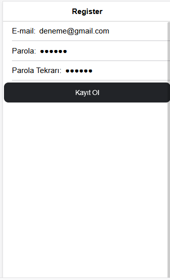

# Oto Galeri Araç Satım Ve Kiralama Uygulaması
 
## Hazırlayan :
170201081 - Abdulkadir Bir

## Özet
 Proje oto galeri şirketlerine sahip kullanıcılara hitap etmekte olup Ionic Framework ile oluşturulmuştur ve veritabanı için Firebase'den yardım alınmıştır. Uygulama için şuanlık sadece web tarayıcı üzerinden erişim sağlanmakta olup herhangi bir apk oluşturulmamıştır. Uygulamanın kurulum aşamaları aşağıdaki alt başlıklarda belirtilmiştir. Bu bölümde uygulamanın genel çalışma prensiplerine yer verilmiştir.
 
 Uygulama ilk çalıştırıldığında kullanıcıya "Login" sayfası gelmektedir. Eğer kullanıcının bir hesabı varsa e mail ile giriş yapabilmektedir. Eğer bir hesabı yoksa email hesabıyla kayıt olabilir. Buradaki kayıtlar oluşturulan örnek bir firebase hesabında tutulmaktadır. Firebase için hesap işlemleri aşağıda belirtilmiştir.
 
 Kullanıcı giriş işlemi yaptıktan sonra uygulama "Anasayfa" ya yönlendirilmektedir. Bu sayfada satılık olan araçları listeleyebilir, kiralık araçları listeleyebilir veya yeni araç ekleyebilir. "Araç ekle" seçeneği ile aracın özellikleri girilecektir ve sonrasında satılık mı yoksa kiralık mı olduğu kullanıcının seçimine göre belirtilecektir. Eklenen araçlar Firebase' de veritabanında tutulmaktadır ve listeleme yaparken aynı şekilde veritabanından gelmektedir.
 
Projede dikkat edilmesi gereken iki husus vardır:
- Birincisi araçları satma ve kiralama mimarisi oluşturulmuştur fakat fonksyionları aktif değildir.
- İkincisi aynı şekilde listede arama yapma mimarisi oluşturulmuştur fakar aktif değildir.

## Kurulum Aşamaları 
Projeyi bilgisayarınıza kurmak için öncelikle bilgisayarınıza [Git](https://git-scm.com/downloads) indirmelisiniz. Zaten halihazırda varsa bilgisayarınızın CMD' sini çalıştırınız. Yeni bir klasör açmak için `$mkdir ornekdosya` ve `$cd ornekdosya` komutunu kullanabilirsiniz. Bu komutlar işletim sisteminize göre farklılık gösterebilir. Yeni klasörünüze giriş yaptıktan sonra `$git clone https://github.com/abdulkadirbir/ionic-app.git` komutunu kullanabilirsiniz. Bu işlemlerden sonra proje bilgisayarınızda oluşturduğunuz yeni klasöre inmiş olacaktır.

## Gerekli Paketler
Bu bölümde bilgisayarınızda kurulması gereken paketler belirtilmiştir :
- Öncelikle [Node Js](https://nodejs.org/en/) indirmelisiniz.
- Bir editörünüz yoksa [Visual Studio Code](https://code.visualstudio.com/) kullanabilirsiniz. Önerilir.
- Yukarıda bahsettiğim ürünler bilgisayarınızda yüklü ise "Terminal" den aşağıdaki komutları girerek indirme işlemlerini yapabilirsiniz. Öncelikli olarak projeyi indirmiş olduğunuz klasör içerisinde `../ionic-mobil-app/app` klasörüne girmeniz gerekmektedir.
- `npm install -g ionic` ionic indirecektir.
- `npm install firebase @angular/fire --save` Firebase işlemleri için gereklidir.
- `ionic serve` uygulamayı çalıştıracaktır.

## Uygulamanın Çalıştırılması
Uygulamayı çalıştırmak için terminalde `../ionic-mobil-app/app` dizinine gidip `ionic serve` dedikten sonra uygulama `http:localhost:8100` adresinde çalışacaktır. 

## ## Firebase Hesap İşlemleri
Uygulamanın düzgün bir şekilde çalışabilmesi için Firebase'de google hesabı oluşturulması gerekmektedir. Halihazırda örnek bir hesaba bağlı olan uygulama kullanıcının dileğine göre başka bir hesapla bağlanabilir. Bunun için gerekli config ayarlamaları yapılmalıdır. Bu işlemler sırasıyla şöyledir:
- Firebase google hesabı açılır. "Konsola Git" bölümünden yeni bir web projesi oluşturulur.
- Daha sonra "Authentication" bölümüne girilir. Burada başlat dedikten sonra ayar bölümünde email kısmını aktif etmek gerekir.
- "Firestore Cloud" bölümü de aynı şekilde aktif edilir.
- "Database" bölümü de aktif edildikten sonra projenin web uygulaması ayarlarına girilir ve orada CDN kodları kopyalanır.
- Uygulamanın içerisinde "firebase.ts" dosyasında var olan config ayarlarıyla yer değiştirilir. Bu işlemleri başarılı bir şekilde yaptıktan sonra uygulamanın bu aşaması tamamlanmış olur.

## Ekran Görüntüleriyle Birlikte Açıklamalar

# SONUÇ 
Uygulama Kocaeli Üniversitesi Mobil Programlama dersi için geliştirilmiştir. Projede istenen isterlerin bir çoğunu karşılamakta olup düzgün bir şekilde çalışmaktadır. Bazı sıkıntılı işlevlerden Özet başlığı altında bahsedilmiştir.

 
